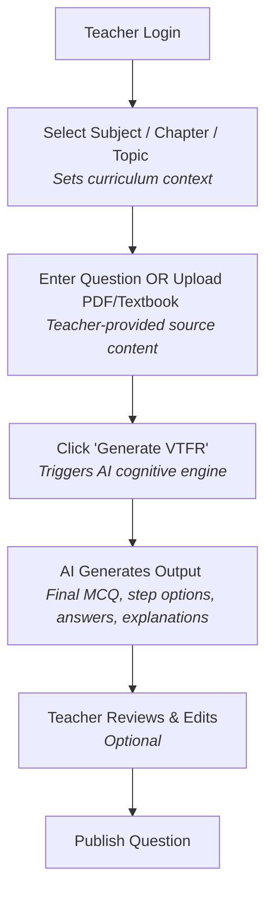
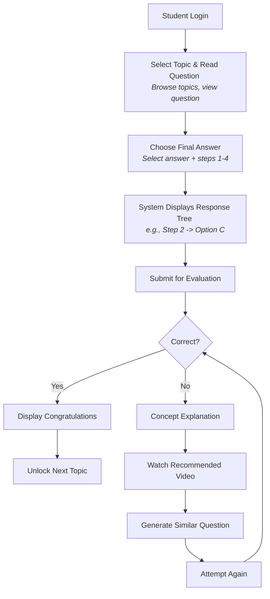

# AI-Powered VTFR Intelligent Learning and Assessment System
## Project Overview & Specifications

This document outlines the core architecture, workflows, and specifications of the AI-Powered VTFR (Variable Time Fixed Result) Intelligent Learning and Assessment System.

---

## 1. Project Title
* **Name of the Project:** AI-Powered VTFR (Variable Time Fixed Result) Intelligent Learning and Assessment System

---

## 2. Problem Statement

* **What is the problem?**  
  Current online examination systems evaluate students only on their final answers, operating on a rigid outcome-based model. They fail to track the step-by-step cognitive reasoning of the student.
* **Who is facing this problem?**
  * **Educators:** Face a massive, time-consuming bottleneck when trying to manually map out student misconceptions and create step-by-step evaluations.
  * **Students:** Do not receive targeted feedback on exact conceptual gaps, as traditional systems only tell them if they are right or wrong.
* **Why does it need to be solved?**  
  The objective is to identify *exactly* where a student made a mistake in their logical reasoning, rather than just grading the final output. Solving this transforms a standard testing tool into an intelligent adaptive learning platform.

---

## 3. Existing System
Traditionally, the workflow for creating a process-based evaluation is highly manual.

**Current Manual Workflow:**  
Teacher Login ➔ Create Subject ➔ Create Chapter ➔ Create Topic ➔ Create Question ➔ Create Final MCQ Options ➔ Create Step 1 ➔ Create Step 2 ➔ Create Step 3 ➔ Create Step 4 ➔ Upload Explanation Video ➔ Publish Question.

---

## 4. Limitations of Existing System
* **Highly Time-Consuming:** Manually generating logical steps, distractors, and explanations for every single question is not scalable for educators.
* **Human Error & Bias:** Manually predicting "common student mistakes" for distractors is inconsistent and error-prone.
* **Lack of Adaptive Learning:** Existing systems do not automatically unlock the next topic upon success or map specific video tutorials to specific step-level failures.

---

## 5. Proposed Solution
An AI-driven platform that completely automates the generation of VTFR questions and facilitates cognitive tracing.

### Key Features:
* **Automated Question Generation:** The AI processes raw text or uploaded textbook PDFs (via RAG) to understand the subject, learning objective, and Bloom's Taxonomy level.
* **Step-Wise Distractor Creation:** The AI automatically divides solutions into logical steps and generates meaningful wrong options (distractors) based on common student misconceptions.
* **Automated Marking & Explanations:** The system auto-identifies the correct answers for all steps and generates multi-tiered explanations (Detailed, Short, Teacher, and Student-Friendly).
* **Adaptive Recommendation Engine:** If a student fails a specific step, the system dynamically recommends targeted notes, videos, or generates similar Easy/Medium/Hard practice questions based on that exact failed concept.

---

## 6. System Workflow

### Teacher Generation Flow

### Student Adaptive Learning Flow

---

## 7. Technology Stack

| Component | Technology/Tool | Functionality / Description |
| :--- | :--- | :--- |
| **Main Programming Language** | Python 3 | • Core language used for writing question generation workflows. • Coordinates diagram creation and handles API client setups. |
| **AI Inference** | OpenAI Python SDK | • Manages remote API requests and formats response validation. • Connects to hosting endpoints including Groq and Hugging Face Router. |
| **AI Models** | Llama-3.3-70B Llama-3.1-8B | • Powers the core reasoning for generating structured text-based VTFR questions. • Analyzes topics to draft precise multi-step plans and code configurations for diagrams. |
| **Fallback & Reliability** | Custom Python Try/Except Fallback System | • Automates recovery by catching primary connection or rate limit errors. • Retries generation seamlessly using a secondary LLM model (Llama-3.1-8B). |
| **Automated Diagram Rendering** | Matplotlib & NumPy | • Dynamically renders math coordinate grids, geometric shapes, flowcharts, tables, and functional graphs. • Saves high-resolution PNG image assets mapping directly to visual learning questions. |
| **Self-Healing Code Execution** | Python `exec()` with Custom Exception Tracking | • Runs LLM-generated plotting scripts dynamically on the local runtime. • Captures syntax/runtime exceptions and feeds traceback output back to the LLM to auto-correct errors. |
| **Configuration & Data Format** | JSON (JavaScript Object Notation) | • Restricts AI outputs using JSON Schema configuration to ensure predictable structure. • Manages questions, options, hints, and alternate steps in structured `.json` payloads. |
| **Syllabus & Course Structure** | Python Dictionaries (`config.py`) | • Structures the curriculum metadata dynamically: Grade ➔ Subject ➔ Chapter ➔ Topic. • Provides a mapped directory for CLI menus and generation targets. |
| **Environment Variable Management** | `python-dotenv` | • Securely loads local API credentials (`GROQ_API_KEY`, `huggingface_API_KEY`) from local `.env` files. • Separates private keys and secrets from the codebase logic. |
| **Output Data Storage** | Local Filesystem Directory Structure | • Saves final structured questions and visual diagram representations under a managed `output/` folder. • Structures file names based on grade, subject, chapter, and topic. |
| **A/B Answer Shuffling** | Randomization Engine (`random.shuffle`) | • Randomizes multiple-choice answer layout orders post-generation. • Removes predictable positional bias from correct answers. |
| **UUID Generation** | UUID v4 (`uuid.uuid4`) | • Enforces standard 128-bit RFC-4122 identifiers across all generated questions and alternative paths. • Ensures globally unique database indexing and structural mapping. |

---

## 8. AI-Powered VTFR Question Generation Workflows

### 1. Normal (Text-Based) VTFR Question Generation Workflow
This pipeline generates adaptive, multi-step text questions containing a primary question, progressive hints, and alternative questions for students who struggle with the initial concept.
* **Phase 1: Menu Selection & Dynamic Syllabus Assembly**
  * Teachers interact with a CLI menu to select Grade, Subject, Chapter, and Topic from `config.py`. If a custom subject/chapter is entered, a lightweight LLM call (`get_topic_suggestions`) dynamically generates 3–4 contextually relevant subtopic suggestions.
* **Phase 2: Orchestrated LLM Request**
  * System and User prompts are fetched from `prompt_templates.py`. The prompt enforces a strict JSON schema containing the primary question, answer options, hints, and `alternateQuestions`. The script targets **Llama-3.3-70B** via Groq or HuggingFace API with a low temperature (0.4) for compliance.
* **Phase 3: Automatic Failover & Reliability**
  * If the primary model fails or encounters rate limits, a `try-except` block catches the exception and routes the payload to the fallback model (**Llama-3.1-8B**).
* **Phase 4: Post-Generation Processing & Storage**
  * **UUID Enforcement:** Ensures all questions contain a valid RFC-4122 UUID v4 identifier.
  * **Option Shuffling:** Answers are shuffled using `random.shuffle` and re-indexed to eliminate layout bias.
  * **Quality Check & Save:** Validates that alternate questions have at least 2 steps, then outputs JSON to the `output/` directory.

### 2. Image-Based MCQ Question Generation Workflow
This pipeline generates visual multiple-choice questions by determining diagram utility, drafting parameters, and rendering assets dynamically via Matplotlib.
* **Phase 1: Suitability Planning & Design**
  * The `plan_image_question` function checks topic suitability. The model outputs JSON confirming `can_generate`, designated `diagram_type`, and initial parameter hints.
* **Phase 2: Structured Content Generation**
  * Generates question text, LaTeX equations, options, and numerical parameters matching the planning phase. Composites the layout into a two-panel grid (Text/Diagram) using Matplotlib and NumPy.
* **Phase 3: Parametric Rendering & Dispatching**
  * A central dispatcher routes instructions based on type: `circuits` (wiring/labels), `geometry` (shapes/dimensions), or `graph` (math expressions via safe NumPy operators).
* **Phase 4: Finalization & Asset Storage**
  * Shuffles options and links the high-resolution `.png` asset inside the `.json` metadata within the `image_questions/` directory.
