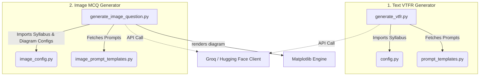

# VTFR Adaptive Learning System - Question Generators Documentation

This document explains the architecture, modular structure, and logical step-by-step workflow of both generators in the VTFR (Virtual Time Fixed Response) system:
1. **VTFR Adaptive Question Generator** (`generate_vtfr.py`)
2. **Image-Based MCQ Question Generator** (`generate_image_question.py`)

---

## 1. Architectural Design & Modularity

Both generator pipelines are split into dedicated, reusable files. This modular design isolates the static curriculum/data configurations and long prompt instructions from the execution logic, making the code clean and presentable.

### Module Descriptions
*   **Main Executable Orchestrators** (`generate_vtfr.py` & `generate_image_question.py`): Manage CLI inputs, model/provider selection, API completions, schema verification, and file system outputs.
*   **Static Data Modules** (`config.py` & `image_config.py`): Contain curriculum dictionaries (`SYLLABUS`) and valid visual configuration schemas (e.g. `VALID_DIAGRAM_TYPES`).
*   **Prompt Modules** (`prompt_templates.py` & `image_prompt_templates.py`): Package complex system and user prompt templates away from code logic.

---

## 2. Dynamic Provider Logic (Groq & Hugging Face)

To guarantee high availability and bypass potential billing limitations (like the Hugging Face `402 - Payment Required` error), both generators support dynamic provider switching:

1.  **Check for Groq**: The script first looks for `GROQ_API_KEY` in environment variables. If present, it routes requests to Groq API (`api.groq.com/openai/v1`) using `llama-3.3-70b-versatile` (70B parameters) as primary and `llama-3.1-8b-instant` as fallback.
2.  **Check for Hugging Face**: If Groq is missing, it falls back to Hugging Face router (`router.huggingface.co/v1`) with `Llama-3.3-70B-Instruct` as primary and `Llama-3.1-8B-Instruct` as fallback.

---

## 3. Logical Step-by-Step Workflows

### A. Text VTFR Question Generator (`generate_vtfr.py`)
1.  **Grade & Syllabus Selection**: CLI menu asks user to pick Grade (1 to College) and subject/chapter/topic from `config.py`.
2.  **Duplicate Detection**: Scans the `generated_question/` directory to build a list of already generated questions to exclude.
3.  **Prompt Assembly**: Invokes template functions in `prompt_templates.py`.
4.  **AI Generation**: Sends request to chosen model in JSON Mode.
5.  **Post-Processing & Shuffling**:
    *   Generates a new UUID v4 if the LLM output's ID is missing.
    *   Shuffles intermediate solution step options (1-4 positions) so that the correct answer is randomized.
    *   Enforces a minimum of 2 steps for scaffolded alternate questions.
6.  **Saving Result**: Writes the completed JSON question payload to `generated_question/`.

### B. Image-Based MCQ Question Generator (`generate_image_question.py`)
1.  **Grade & Syllabus Selection**: CLI menu asks user to pick Grade and subject/chapter/topic from `image_config.py`.
2.  **Step 1: Planning**: 
    *   AI decides whether the topic needs a visual diagram (e.g., Circle Theorems) and selects a diagram type (e.g., `circle`, `parallel_circuit`, `right_triangle`) from `VALID_DIAGRAM_TYPES` in `image_config.py`.
    *   Outputs a question hint and numeric parameters (e.g. `{"radius": 5, "angle": 60}`).
3.  **Step 2: Generation**: 
    *   Queries the LLM using prompt templates in `image_prompt_templates.py` containing the planned numeric values.
    *   LLM generates the MCQ question details (body, options list, correct answer, calculation draft).
4.  **Step 3: Rendering**:
    *   The dispatch dictionary maps the planned `diagramType` to its respective private Matplotlib helper drawing function (e.g. `_draw_circle`, `_draw_parallel_circuit`).
    *   Outputs a combined PNG diagram.
5.  **Saving Results**: Writes the MCQ details as JSON and the rendered diagram as PNG to the `generated_question/image_questions/` directory.
